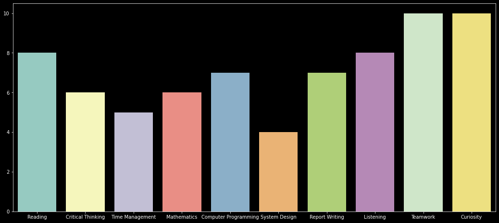

# Portfolio
This portfolio is owned by an advanced beginner. It contains some of the projects done during my training at Stutern Graduate Trainee(SGA). 

---
title: "CV"
author: "Patience Otselemi Kadiri"
date: "11/01/2020"
output: pdf_document
---

## Overview of my data science profile

I am adventrous with little technical background. I have, in the past months been able to get my hands on materials to brush up my technical skills and also to properly acquaint myself with major aspects for better understanding of underlying principles in the tech field. I am mostly intrigued by the data science profession and would like to get on any interesting project. Please find below a barchart of my data science profile.

```{python echo=FALSE}
import pandas as pd
import numpy as np
import seaborn as sns
import matplotlib.pyplot as plt

Book = {"Criteria" : ["Reading", "Critical_thinking", "Time_management", "Mathematics", "Computer_progamming", "System_design", "Report_writing", "Listening", "Teamwork", "Curiosity"], "Score" : [8, 6, 5, 6, 7, 4, 7, 8, 10, 10] }
Book2 = pd.DataFrame(Book, columns = ["Criteria", "Score"])

skill_rank = pd.read_csv('Book2.csv')


plt.style.use('dark_background')
plt.figure(figsize = (18, 8))
sns.barplot(data = skill_rank)
```



